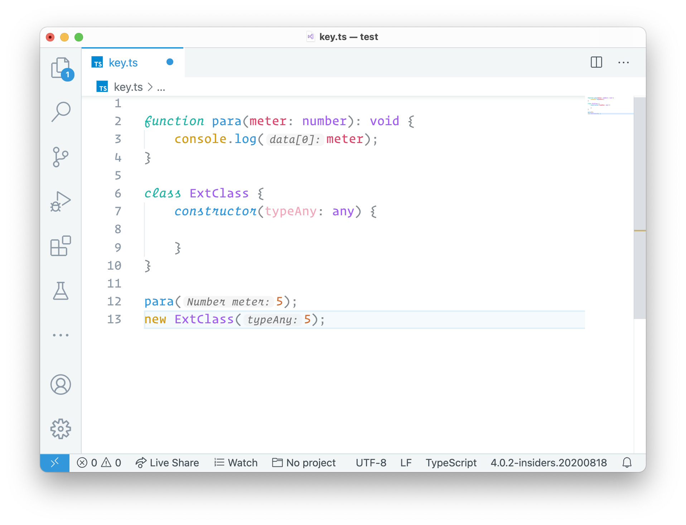

# InlayHints

Shows the inlayhints of the called function

&nbsp; &nbsp;

## Supported languages *

- PHP

&nbsp; \* _Feel free to contribute_

## Credits

[Dash-AST](https://github.com/goto-bus-stop/dash-ast)\
[TypeScript](https://github.com/microsoft/typescript/)\
[web-tree-sitter](https://www.npmjs.com/package/web-tree-sitter)
